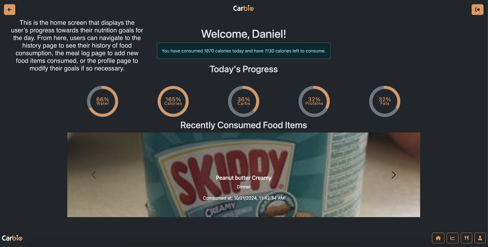
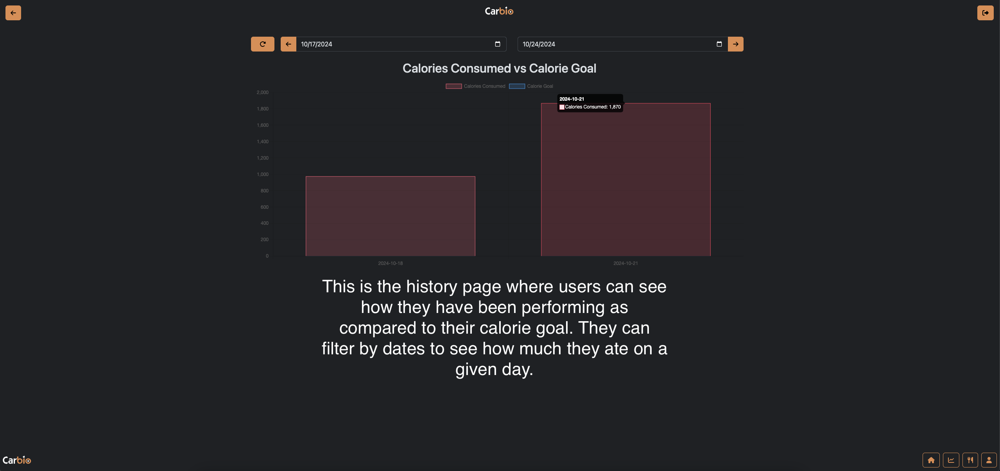
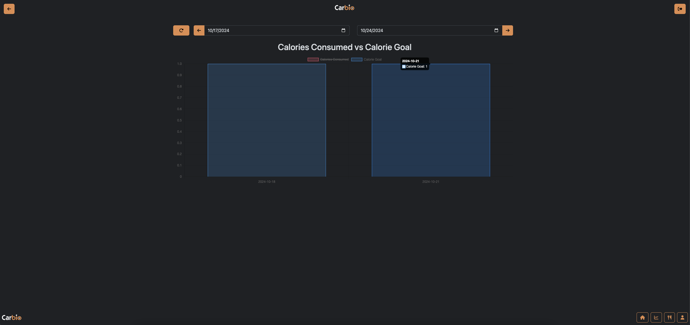
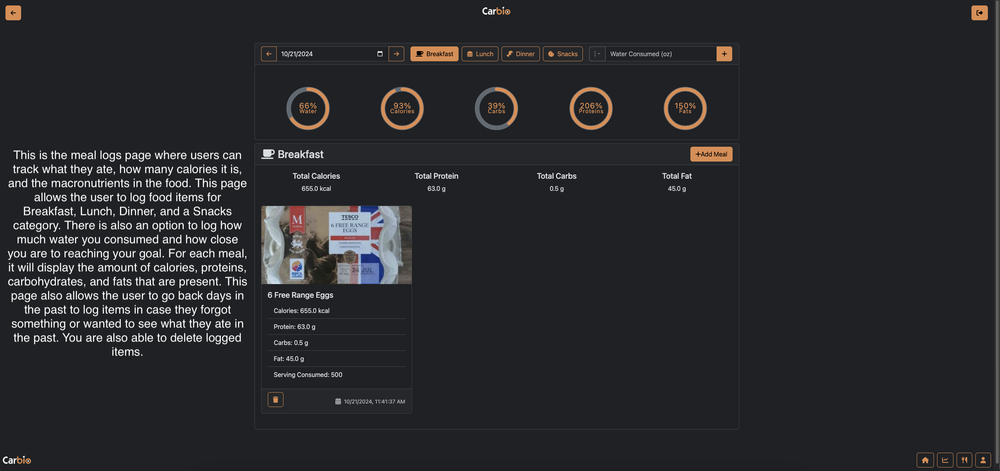
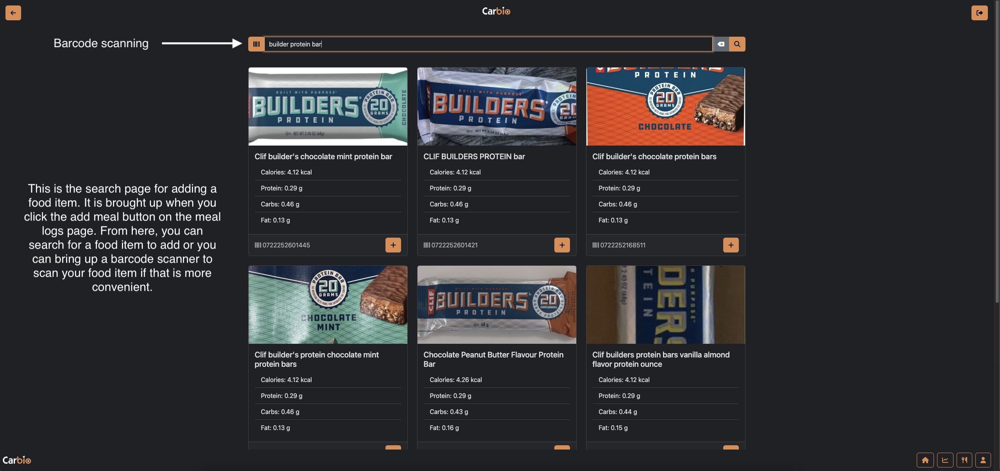
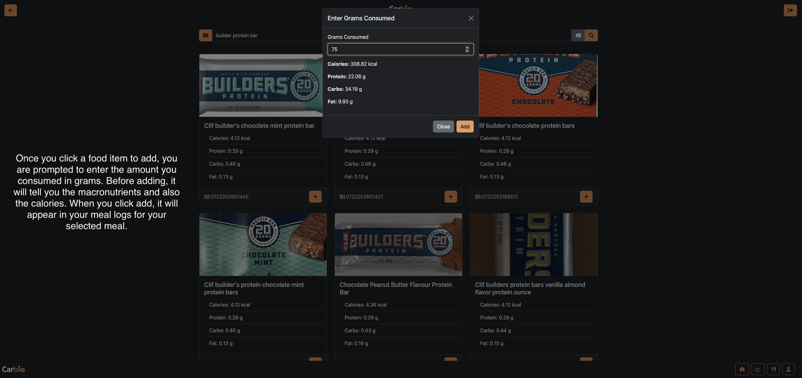
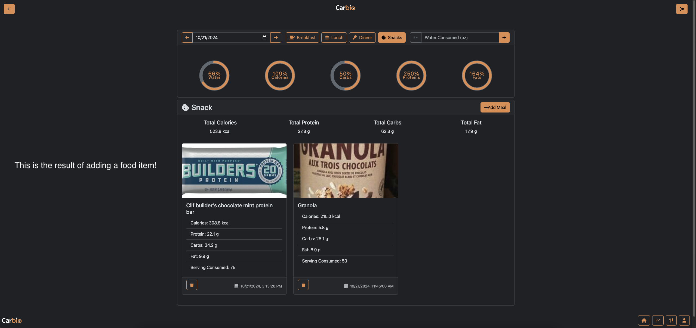
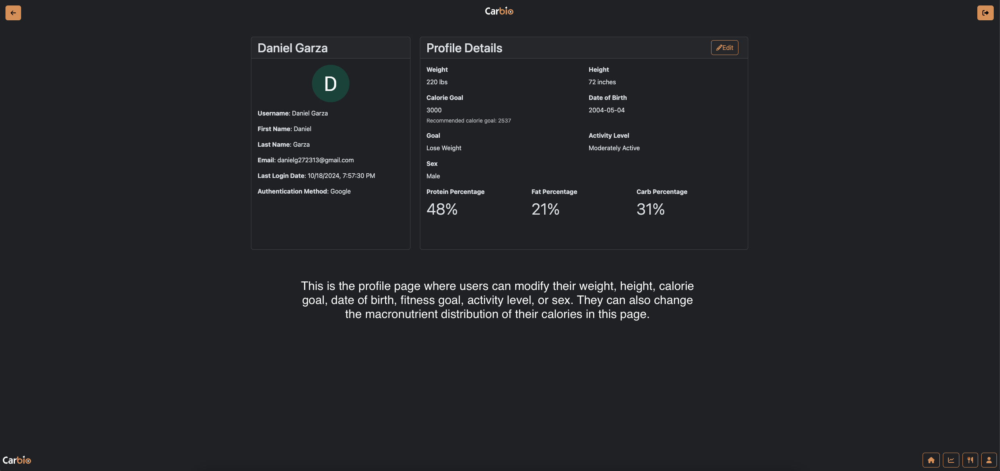

# Carbio - Nutrition Tracker
[](https://coder.galifrey.dev/templates/coder/DockerRepoClone/workspace?mode=manual&param.Git+repo+http+URL=https%3A%2F%2Fgithub.com%2FEndgame-Engineers%2FCS350-Project-1)
## Prereqs
- Must have Docker (https://docs.docker.com/get-started/get-docker/)
- Google Console API ClientID and ClientSecret (https://developers.google.com/workspace/guides/create-project)
- Add callback to Google API: `http://localhost:3000/api/auth/google/callback`
## How to Run
Clone down repo: 
```git clone https://github.com/Endgame-Engineers/CS350-Project-1```

Modify `.env-example` and rename to `.env`
```
DB_USERNAME=carbio
DB_PASSWORD=carbio
DB_HOST=postgres
DB_PORT=5432
DB_DATABASE=thedatabase
GOOGLE_CLIENT_ID=<YOUR_GOOGLE_CLIENT_ID>
GOOGLE_CLIENT_SECRET=<YOUR_GOOGLE_CLIENT_SECRET>
SESSION_SECRET=<YOUR_SESSION_SECRET>
POSTGRES_USER=carbio
POSTGRES_PASSWORD=carbio
POSTGRES_DB=thedatabase
```
Start docker using docker compose:
```docker compose up -d``` (daemonize) or ```docker compose up```

Connect to `http://localhost:3000/`

Profit????

# Screenshots on how the project works
## Home Page


## History Page



## Add Meal Page





## Profile Page


# List of features that we plan to implement for the rest of the semester
- Allow the user to create their own food items and add them to their meals
- Read Health Data and Activity Data from Google Fit API
- Implement the tracking of micronutrients
